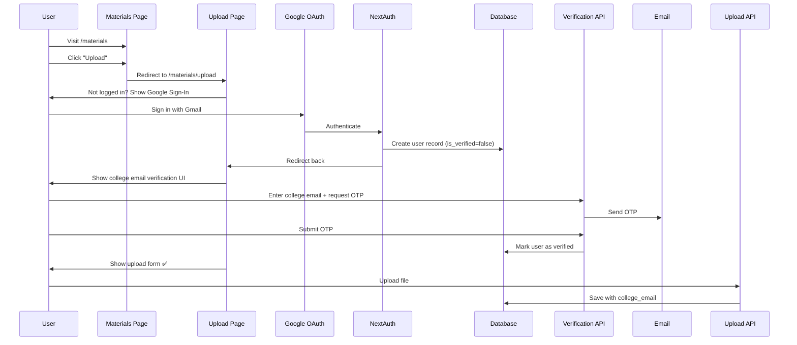

# 🔐 HYBRID AUTHENTICATION SYSTEM - IMPLEMENTATION GUIDE

## ✅ What Has Been Implemented

This guide documents the **hybrid authentication system** that allows students to log in with personal Gmail accounts while restricting uploads to verified KMIT students.

---

## 🏗️ System Architecture

### Two-Level Authentication:

1. **Identity** → Google OAuth (any Google account)
2. **Authorization** → College email verification (@kmit.edu.in)

### Access Control:

- **Viewing materials**: Public ✅
- **Uploading materials**: OAuth login + verified college email ✅

---

## 📁 Files Modified/Created

### 1. Authentication Setup

**File**: `app/api/auth/[...nextauth]/route.ts`

- ✅ Removed domain restriction (allows any Google account)
- ✅ Creates user record on first login
- ✅ Fetches verification status in JWT callback

### 2. Verification UI

**File**: `components/CollegeEmailVerification.tsx`

- ✅ College email input with validation
- ✅ OTP input interface
- ✅ Success state with auto-redirect
- ✅ Error handling

### 3. Verification API

**Files**:

- `app/api/verify-email/send-otp/route.ts` - Sends 6-digit OTP
- `app/api/verify-email/verify-otp/route.ts` - Verifies OTP and marks user as verified

### 4. Upload Page Protection

**File**: `app/materials/upload/page.tsx`

- ✅ Checks authentication
- ✅ Shows verification UI if not verified
- ✅ Shows upload form if verified

### 5. Upload API Protection

**File**: `app/api/upload/route.ts`

- ✅ Validates user authentication
- ✅ Checks verification status
- ✅ Uses college email for `uploaded_by` field

### 6. Database Setup

**File**: `supabase-setup.sql`

- ✅ SQL script for creating `email_verifications` table
- ✅ Indexes and RLS policies

### 7. TypeScript Types

**File**: `types/next-auth.d.ts`

- ✅ Extended NextAuth types with verification fields

---

## 🗄️ Database Structure

### Table 1: `users` (You created this ✅)

```sql
users
├── id (uuid, PK)
├── google_email (text, unique)
├── college_email (text)
├── is_verified (boolean, default: false)
└── created_at (timestamp)
```

### Table 2: `email_verifications` (Run SQL script to create)

```sql
email_verifications
├── id (uuid, PK)
├── google_email (text, unique)
├── college_email (text)
├── otp (text)
├── expires_at (timestamp)
├── verified (boolean, default: false)
├── created_at (timestamp)
└── updated_at (timestamp)
```

---

## 🚀 Setup Instructions

### Step 1: Run Database Migration

1. Open Supabase Dashboard → SQL Editor
2. Copy content from `supabase-setup.sql`
3. Run the SQL script
4. Verify tables are created

### Step 2: Configure Environment Variables

Ensure your `.env.local` has:

```env
# NextAuth
NEXTAUTH_SECRET=your-secret-here
NEXTAUTH_URL=http://localhost:3000

# Google OAuth
GOOGLE_CLIENT_ID=your-client-id
GOOGLE_CLIENT_SECRET=your-client-secret

# Supabase
NEXT_PUBLIC_SUPABASE_URL=your-supabase-url
NEXT_PUBLIC_SUPABASE_ANON_KEY=your-anon-key
SUPABASE_SERVICE_ROLE_KEY=your-service-role-key
```

### Step 3: Update Google OAuth Settings

1. Go to [Google Cloud Console](https://console.cloud.google.com/)
2. Navigate to your OAuth 2.0 Client
3. **Important**: Remove any domain restrictions
4. Ensure authorized redirect URIs include:
   - `http://localhost:3000/api/auth/callback/google`
   - `https://yourdomain.com/api/auth/callback/google` (for production)

### Step 4: Test the System

1. Start your dev server: `npm run dev`
2. Go to `/materials/upload`
3. Sign in with **any Google account** (not just @kmit.edu.in)
4. You should see the verification screen
5. Enter a @kmit.edu.in email
6. Check console for OTP (in development mode)
7. Verify OTP
8. Upload form should appear

---

## 🔄 User Flow (End-to-End)



---

## 🎯 Key Features

### Security

- ✅ No hardcoded domain restriction on OAuth
- ✅ Server-side verification check
- ✅ OTP expires after 10 minutes
- ✅ College email uniqueness check
- ✅ Row-level security on database tables

### User Experience

- ✅ Simple, intuitive verification flow
- ✅ Clear error messages
- ✅ Auto-redirect after verification
- ✅ Development mode shows OTP in console

### Data Integrity

- ✅ Only verified students can upload
- ✅ Uploader tracked by college email
- ✅ One college email per Google account

---

## 🧪 Testing Checklist

- [ ] Login with personal Gmail works
- [ ] Unverified users see verification screen
- [ ] OTP is sent successfully
- [ ] Invalid OTP is rejected
- [ ] Expired OTP is rejected
- [ ] Valid OTP marks user as verified
- [ ] Verified users can upload
- [ ] Upload shows college email as uploader
- [ ] Duplicate college email is rejected
- [ ] Materials page remains public

---

## 🐛 Troubleshooting

### Issue: "OTP not received"

**Solution**: Check Supabase email settings and SMTP configuration

### Issue: "User not found" error

**Solution**: Ensure `users` table has proper RLS policies for service_role

### Issue: "College email already used"

**Solution**: This is expected - one college email per account

### Issue: "Session not updating after verification"

**Solution**: Page reload is triggered automatically after verification

---

## 📊 Interview Explanation

> **Q: How does your authentication work?**
>
> **A**: "We use a hybrid authentication system. Students log in with their personal Gmail via Google OAuth for identity. Then, they verify their college email (@kmit.edu.in) through an OTP-based system for authorization. This ensures only verified KMIT students can upload materials while allowing them to use their preferred email for login. Materials viewing remains public for everyone."

---

## 🔧 Maintenance

### Periodic Cleanup (Optional)

Run this SQL query to remove expired verification records:

```sql
DELETE FROM public.email_verifications
WHERE expires_at < NOW() - INTERVAL '24 hours';
```

### Monitor Verification Success Rate

```sql
SELECT
  COUNT(*) FILTER (WHERE verified = true) as verified_count,
  COUNT(*) FILTER (WHERE verified = false) as pending_count
FROM email_verifications
WHERE created_at > NOW() - INTERVAL '7 days';
```

---

## ✨ Next Steps (Optional Enhancements)

1. **Email Service**: Integrate SendGrid/Resend for better email delivery
2. **Rate Limiting**: Add rate limiting on OTP generation
3. **Admin Dashboard**: View all verified users
4. **Bulk Verification**: Import verified emails from CSV
5. **Magic Links**: Alternative to OTP for verification

---

## 📝 Notes

- Development mode logs OTP to console for easy testing
- Production mode will send OTP via Supabase Auth email
- Session updates automatically after verification
- All database operations use service role for security

---

**Implementation Status**: ✅ COMPLETE
**Last Updated**: January 4, 2026
**Developer**: Copilot + Your Team
